# Relazione tecnica: migrazione strutturale da OpenSearch a PostgreSQL

## Decisioni applicate

- I dati di sviluppo non vengono migrati: le strutture incompatibili vengono svuotate durante l'aggiornamento.
- Tutte le entità applicative usano `BIGINT GENERATED ... AS IDENTITY` e quindi ID numerici autoincrementali.
- `legacy_id` non viene creato né mantenuto.
- Il catalogo prima indicizzato è normalizzato nel singolo schema PostgreSQL del tenant.
- Le relazioni prima rappresentate da ID dentro documenti JSON sono ora tabelle di associazione e foreign key.
- `keycloak_id` resta una chiave esterna di autenticazione, non è la primary key applicativa.

## Modifiche backend

1. Le entità `Album`, `Track`, `Instrument`, `Media`, `User`, `CalendarEvent`, `UploadJob`, spartiti e costi sono entità JPA.
2. Il CRUD, la paginazione, l'ordinamento e i criteri di filtro sono eseguiti con repository e `Specification` PostgreSQL.
3. Le associazioni ordinate usano tabelle ponte con `display_order`.
4. Disponibilità e presenze agli eventi sono record relazionali univoci per coppia evento/utente.
5. Gli utenti hanno un'identità globale collegata a Keycloak e un profilo locale per tenant.
6. La cancellazione GDPR elimina o anonimizza record relazionali e file gestiti senza scansioni di indici.
7. La ricerca inventario usa direttamente le query PostgreSQL; outbox e proiettore OpenSearch sono rimossi.
8. Client, configurazione, changelog, risorse e container OpenSearch sono rimossi.
9. I nomi Java `*OpenSearch*` ancora presenti sono alias interni di compatibilità e ora contengono esclusivamente implementazione JPA; non esiste una dipendenza runtime da OpenSearch.

## Modifiche frontend

- `id`, riferimenti figli e riferimenti inventario sono `number`.
- Route e parametri HTTP convertono i valori testuali del router in numeri prima di invocare i servizi.
- Le API di utenti, tenant, media, tracce ed eventi accettano ID numerici.
- Gli ordinamenti `name.keyword` sono sostituiti da colonne PostgreSQL (`name`).
- Il confronto disponibilità evento usa l'ID numerico del profilo utente restituito dal backend, non il subject Keycloak.
- Non è previsto alcun campo `legacy_id` nei modelli FE.

## Strategia dati e rilascio

1. All'avvio applicare prima il changelog globale, che crea tenant e identità globali.
2. Subito dopo applicare `tenant-master.xml` a ogni schema registrato come `ACTIVE`; Liquibase esegue soltanto i changeset mancanti e blocca l'avvio se un tenant non può essere aggiornato.
3. Alla creazione di un nuovo tenant, creare immediatamente lo schema e applicare lo stesso `tenant-master.xml`.
4. Il changelog finale svuota i soli dati di sviluppo incompatibili, converte i riferimenti inventario a `BIGINT`, converte `push_reminders.event_id` e rimuove `inventory_search_outbox`.
5. Gli strumenti musicali iniziali vengono caricati da CSV nello schema del tenant.
6. Avviare il backend senza variabili o servizi OpenSearch.

## Schema E/R completo

### Schema globale `public`

| Tabella | Scopo | Relazioni |
|---|---|---|
| `tenant` | anagrafica tenant | PK `id`; 1:1 con `tenant_schema_registry`; N:M con `user_identity` |
| `user_identity` | identità globale autenticata | PK `id`; `keycloak_id` univoco; N:M con `tenant` |
| `tenant_user_membership` | appartenenza identità/tenant | PK/FK composta (`tenant_id`, `user_identity_id`) |
| `tenant_schema_registry` | stato di provisioning | FK univoca `tenant_id`; `tenant_code` identifica lo schema |
| `legal_document` | versioni dei documenti legali | referenziata dalle accettazioni nei tenant |
| `jhi_date_time_wrapper` | tabella tecnica JHipster | nessuna relazione di dominio |

### Schema di ogni tenant

| Area | Tabelle |
|---|---|
| Utenti | `app_user`, `app_user_role`, `user_instrument` |
| Catalogo musicale | `instrument`, `album`, `track`, `track_type`, `album_track`, `sheet_music`, `media_asset`, `sheet_music_media`, `sheet_music_instrument` |
| Calendario | `calendar_event`, `calendar_event_cost`, `calendar_event_availability`, `calendar_event_presence` |
| Elaborazioni | `upload_job` |
| Preferenze e comunicazioni | `last_research`, `notices`, `preferences`, `push_subscriptions`, `push_reminders` |
| Legale | `user_legal_acceptance` |
| Inventario | `inventory_item`, `inventory_item_photo`, `inventory_assignment`, `inventory_assignment_revision`, `inventory_assignment_decision`, `inventory_return`, `inventory_return_photo`, `inventory_erasure_request`, `inventory_report_export` |
| Tecniche Liquibase | `databasechangelog`, `databasechangeloglock` |

```mermaid
erDiagram
    TENANT ||--o| TENANT_SCHEMA_REGISTRY : provisions
    TENANT ||--o{ TENANT_USER_MEMBERSHIP : contains
    USER_IDENTITY ||--o{ TENANT_USER_MEMBERSHIP : joins
    USER_IDENTITY ||--o{ APP_USER : profiles

    APP_USER ||--o{ APP_USER_ROLE : has
    APP_USER ||--o{ USER_INSTRUMENT : plays
    INSTRUMENT ||--o{ USER_INSTRUMENT : assigned

    ALBUM ||--o{ ALBUM_TRACK : contains
    TRACK ||--o{ ALBUM_TRACK : included_in
    TRACK ||--o{ TRACK_TYPE : classified_as
    TRACK ||--o{ SHEET_MUSIC : has
    SHEET_MUSIC ||--o{ SHEET_MUSIC_MEDIA : uses
    MEDIA ||--o{ SHEET_MUSIC_MEDIA : referenced_by
    SHEET_MUSIC ||--o{ SHEET_MUSIC_INSTRUMENT : scored_for
    INSTRUMENT ||--o{ SHEET_MUSIC_INSTRUMENT : required_by

    CALENDAR_EVENT ||--o{ CALENDAR_EVENT_COST : costs
    CALENDAR_EVENT ||--o{ CALENDAR_EVENT_AVAILABILITY : responses
    APP_USER ||--o{ CALENDAR_EVENT_AVAILABILITY : responds
    CALENDAR_EVENT ||--o{ CALENDAR_EVENT_PRESENCE : presences
    APP_USER ||--o{ CALENDAR_EVENT_PRESENCE : attends
    CALENDAR_EVENT ||--o{ PUSH_REMINDERS : schedules

    APP_USER ||--o{ UPLOAD_JOB : submits
    TRACK o|--o{ UPLOAD_JOB : targets

    LEGAL_DOCUMENT ||--o{ USER_LEGAL_ACCEPTANCE : accepted_as

    INVENTORY_ITEM ||--o{ INVENTORY_ITEM_PHOTO : has
    INVENTORY_ITEM ||--o{ INVENTORY_ASSIGNMENT : assigned
    APP_USER ||--o{ INVENTORY_ASSIGNMENT : receives
    INVENTORY_ASSIGNMENT ||--o{ INVENTORY_ASSIGNMENT_REVISION : versioned
    INVENTORY_ASSIGNMENT_REVISION ||--o| INVENTORY_ASSIGNMENT_DECISION : decided
    INVENTORY_ASSIGNMENT ||--o{ INVENTORY_RETURN : returned
    INVENTORY_RETURN ||--o{ INVENTORY_RETURN_PHOTO : documented
    APP_USER ||--o{ INVENTORY_ERASURE_REQUEST : requests
    APP_USER ||--o{ INVENTORY_REPORT_EXPORT : reported
```

### Vincoli principali

- Tutte le PK di dominio sono `BIGINT` identity.
- Le tabelle ponte impediscono duplicati con PK o `UNIQUE` composte.
- Le collezioni ordinate impongono `UNIQUE(parent_id, display_order)`.
- `calendar_event_availability` e `calendar_event_presence` impongono un solo record per evento/utente.
- `inventory_assignment.user_index`, `inventory_erasure_request.user_index` e `inventory_report_export.requested_user_index` sono FK numeriche verso `app_user.id`.
- `push_reminders.event_id` è FK numerica verso `calendar_event.id`.
- I campi `user_id` storici di preferenze/notifiche/push conservano il subject Keycloak per compatibilità con autenticazione e cancellazione; la relazione applicativa è risolta tramite `app_user.keycloak_id`, che è univoco.
