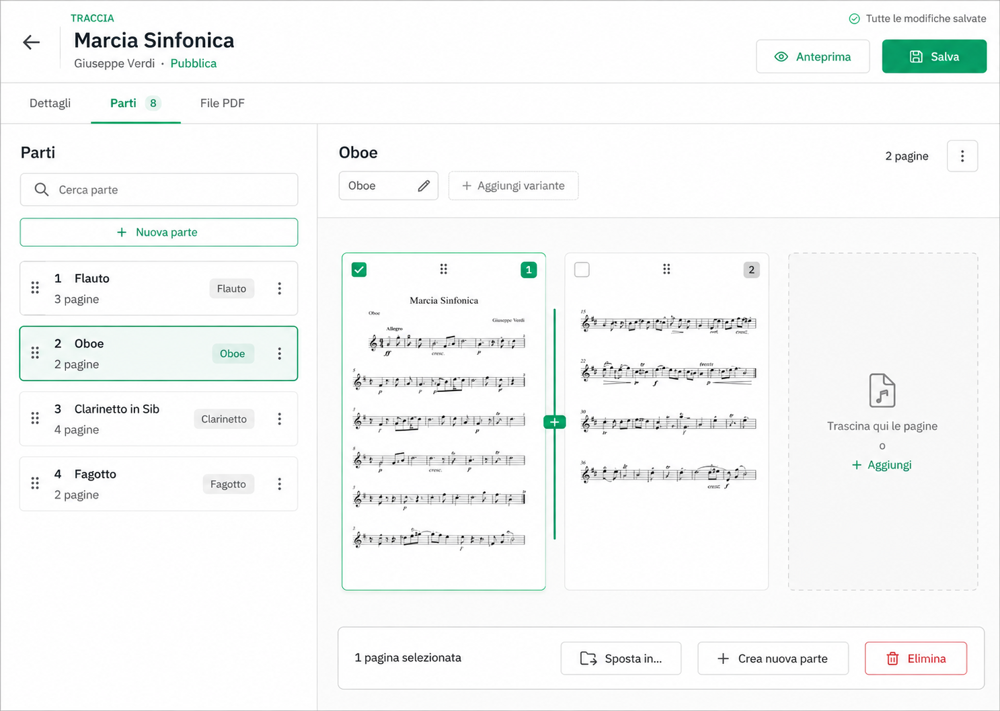

# Gestione delle parti di una traccia

**SPECIFICA UX E TECNICA**

Workspace a due pannelli per organizzare strumenti e pagine degli spartiti

| Voce | Valore |
| --- | --- |
| Prodotto | Taurus frontend |
| Stato | Direzione approvata, implementazione in corso |
| Versione | 1.1 |
| Data | 9 settembre 2026 |
| ID catalogo | `track-parts-workspace` |

Lo stato corrente è pubblicato nel [Catalogo funzionalità](features.md).

ID catalogo: `track-parts-workspace`.

### Decisione

La gestione delle parti sarà trasformata da tabella con dialog separato a workspace master detail. L’elenco delle parti resta visibile a sinistra; la parte selezionata, i suoi strumenti e le relative pagine occupano il pannello principale. Le modifiche avvengono nel contesto e le pagine possono essere riordinate o spostate direttamente.

Il primo rilascio mantiene il salvataggio esplicito della traccia e il contratto di upload PDF già esistente. L’interfaccia distingue in modo netto la bozza locale dall’elaborazione asincrona del PDF.

## 1 Sintesi e obiettivi

Questa specifica definisce il comportamento, la struttura visuale e i vincoli tecnici del nuovo workspace Parti. È destinata a chi progetta, implementa e verifica il frontend Angular e le eventuali estensioni del backend Spring Boot.

### Obiettivi

- Rendere visibili le pagine dello spartito senza aprire popover o gallerie separate.
- Consentire riordino, spostamento, unione e divisione senza perdere il contesto della traccia.
- Ridurre i passaggi necessari per assegnare o correggere gli strumenti.
- Esplicitare quali modifiche sono locali e quando diventano persistenti.
- Mantenere il flusso utilizzabile con tastiera, touch e viewport ridotte.

### Problemi del flusso attuale

| Problema | Effetto sull’utente | Risposta progettuale |
| --- | --- | --- |
| Tabella paginata | Le parti sono separate dal loro contenuto visuale e il riordino attraversa una vista filtrabile e paginata. | Elenco persistente senza paginazione client e dettaglio della parte selezionata. |
| Modifica in dialog | Per cambiare strumenti o pagine si perde la vista delle altre parti. | Editor inline nel pannello di destra. |
| Anteprime come icone | È necessario aprire un’altra superficie per riconoscere una pagina. | Miniature leggibili nel workspace. |
| Azioni massive distanti | Selezione e risultato di unione o eliminazione sono difficili da prevedere. | Barra contestuale vicino al contenuto selezionato. |
| Salvataggi diversi | Upload immediato e riordino in bozza comunicano stati differenti nello stesso schermo. | Stati e messaggi separati per job PDF e bozza della traccia. |

### Metriche di successo

- Una parte può essere selezionata e compresa senza aprire un dialog.
- Una pagina può essere spostata in un’altra parte con un’unica azione diretta oppure con un comando da tastiera.
- Ogni modifica comunica immediatamente se è in bozza, salvata o non riuscita.
- Le operazioni principali restano disponibili fino ad almeno 200 parti e 1 000 pagine senza introdurre paginazione nel workspace.

## 2 Direzione visuale

Il mockup seguente rappresenta la direzione approvata. Non fissa ancora dimensioni definitive o dettagli grafici, ma costituisce il riferimento per gerarchia, distribuzione delle funzioni e modello di interazione.

*Figura 1  Workspace Parti a due pannelli*

### Gerarchia della pagina

1. Intestazione della traccia con navigazione indietro, titolo, metadati, anteprima e salvataggio.
2. Navigazione interna tra Dettagli, Parti e File PDF. Il conteggio delle parti è visibile nella scheda.
3. Pannello sinistro per ricerca, creazione, selezione e riordino delle parti.
4. Pannello destro per strumenti, pagine, selezione e azioni contestuali.
5. Indicatore persistente dello stato di salvataggio, indipendente dallo stato dei job PDF.

## 3 Architettura dell’interfaccia

### Navigazione interna

Il dettaglio della traccia usa le schede Dettagli e Parti per tutti i ruoli autorizzati alla consultazione. File PDF è visibile esclusivamente a super amministratori, amministratori e archivisti, che possono contribuire all’arricchimento della traccia. Le schede non diventano nuove route nel primo rilascio; lo stato attivo può essere rappresentato nel query parameter per consentire refresh e collegamenti diretti. Un ruolo non autorizzato che apre un collegamento con `tab=pdf` resta su Dettagli e non avvia il caricamento dei job PDF. La scheda Parti è selezionata automaticamente dopo il completamento di un’azione di organizzazione avviata dall’utente.

### Pannello delle parti

| Elemento | Comportamento |
| --- | --- |
| Ricerca | Filtra per nome descrittivo e nomi degli strumenti. Non cambia l’ordine persistito. |
| Nuova parte | Crea una parte vuota dopo l’ultima parte e la seleziona immediatamente. |
| Riga parte | Mostra ordine, descrizione sintetica, strumenti e numero di pagine. |
| Selezione | Una sola parte attiva determina il contenuto del pannello destro. |
| Riordino | Trascinamento tramite maniglia; durante la ricerca il riordino è disabilitato per evitare risultati ambigui. |
| Menu | Espone duplica, dividi per pagina ed elimina. Le azioni distruttive richiedono conferma. |

La ricerca occupa sempre tutta la larghezza utile del pannello. Il wrapper e l’input non possono adottare una larghezza intrinseca né cambiare dimensione dopo focus, digitazione o azzeramento del filtro.

### Pannello della parte selezionata

- Il titolo deriva dalla descrizione della parte; se assente, usa il primo strumento o Parte senza nome.
- Gli strumenti sono modificabili con selezione multipla filtrabile e visualizzazione a chip. Il controllo di ricerca e assegnazione è fluido e occupa sempre tutta la larghezza della propria colonna, prima e dopo l’interazione.
- Le miniature mantengono il rapporto della pagina, riportano ordine e stato di selezione e aprono l’anteprima ingrandita tramite pulsante esplicito, Invio o doppio clic.
- Gli spazi di inserimento compaiono durante il trascinamento e comunicano la posizione finale prima del rilascio.
- La zona Aggiungi accetta pagine provenienti da un nuovo PDF o da media già associati alla traccia, se il contratto backend lo consente.

### Allineamento al sistema visuale

- Schede e pannello attivo costituiscono una singola zona visuale, con bordi allineati e senza fasce laterali o inferiori prodotte da overflow o padding esterni.
- Card, campi e pannelli usano raggi, bordi e colori semantici del tema; nessun colore di superficie viene fissato per il solo tema chiaro.
- La separazione verticale tra zone segue il contenitore strutturale con `gap: 2rem`, come definito nel [Taurus Layout Standard](taurus-layout-standard.md); le card non introducono margini esterni propri.
- I controlli destinati a occupare una colonna sono fluidi dal primo rendering e mantengono la stessa larghezza dopo focus, ricerca, selezione o aggiornamento del modello.

### Dimensioni e densità

Il workspace privilegia la leggibilità delle pagine senza sacrificare la scansione dell’elenco. Le soglie seguenti guidano il prototipo responsive e potranno essere affinate con test su dati reali.

| Regola | Desktop | Tablet |
| --- | --- | --- |
| Rapporto pannelli | 34 per cento e 66 per cento | 40 per cento e 60 per cento |
| Larghezza minima elenco | 280 px | 260 px |
| Miniatura | 220 a 280 px di larghezza | 180 a 220 px |
| Area scroll | Scroll principale condiviso; elenco parti sticky con scroll interno solo se supera la viewport | Scroll principale condiviso |
| Barra contestuale | Fissata al fondo del pannello destro | Fissata al fondo della viewport |

## 4 Modello di interazione

### Selezionare e modificare una parte

1. L’utente seleziona una riga nel pannello sinistro.
2. Il pannello destro mostra strumenti e pagine della parte e imposta la prima pagina come riferimento del navigatore.
3. Una modifica agli strumenti aggiorna immediatamente la bozza locale e attiva Salva.
4. Il passaggio a un’altra parte non chiude un dialog e non perde la modifica.

### Navigare e consultare le pagine

- Sopra la griglia, quando sono presenti almeno due pagine, compaiono i comandi Pagina precedente e Pagina successiva con l’indicazione Pagina x di n.
- L’attivazione di un comando aggiorna la pagina corrente, porta la card nella porzione visibile e le assegna il focus.
- Il media della pagina si apre dal pulsante Apri anteprima, con doppio clic sulla card o con Invio quando la card ha il focus.
- La pagina corrente e le pagine selezionate hanno stati distinti: navigare non seleziona e selezionare non apre automaticamente l’anteprima.
- Le frecce presenti nel piede della card sono esclusivamente comandi di riordino. Etichetta accessibile e tooltip usano il verbo Riordina per non confonderle con il navigatore.
- La griglia non usa paginazione client: tutte le pagine restano raggiungibili tramite lo scroll principale e i comandi di navigazione.

### Riordinare le pagine

Il trascinamento parte solo dalla maniglia della miniatura. Il sistema mostra un segnaposto della stessa dimensione e un indicatore di inserimento. Al rilascio rinumera le pagine della parte da 1 a n e mantiene selezionata la pagina spostata.

### Spostare pagine tra parti

| Modalità | Sequenza | Esito |
| --- | --- | --- |
| Trascinamento | Trascinare una o più pagine sulla riga di destinazione o nel suo pannello. | Le pagine vengono aggiunte nella posizione indicata; la parte sorgente resta selezionata salvo svuotamento. |
| Barra contestuale | Selezionare le pagine e scegliere Sposta in. | Si apre un elenco ricercabile di parti con conferma immediata. |
| Nuova parte | Selezionare le pagine e scegliere Crea nuova parte. | Nasce una parte dopo quella corrente, con strumenti vuoti e pagine nell’ordine di selezione. |

### Unire parti

L’unione resta un’azione sulle parti, non sulle pagine. Dopo l’attivazione della modalità Seleziona parti, la barra contestuale mostra il numero di parti, l’ordine di concatenazione e l’azione Unisci. Il risultato usa la posizione della prima parte, concatena le pagine nell’ordine delle parti e rimuove duplicati dagli strumenti mantenendo il primo ordine incontrato.

### Dividere una parte

Dividi propone due modalità: una nuova parte per ogni pagina oppure divisione dopo la pagina selezionata. La seconda è predefinita perché corrisponde al caso più comune e produce un risultato prevedibile. La conferma descrive quante parti saranno create e conserva gli strumenti in entrambe.

### Annullare

Il primo rilascio offre Annulla ultima operazione per riordino, spostamento, unione, divisione ed eliminazione non ancora salvati. È sufficiente una cronologia locale lineare della sessione; dopo Salva la cronologia viene azzerata. La conferma distruttiva resta necessaria per eliminare pagine o parti.

### Regole trasversali

- Dopo ogni operazione gli ordini restano continui e partono da 1.
- La selezione segue pagine e parti spostate, anche quando cambia il contenitore.
- Una parte svuotata non viene eliminata automaticamente: resta disponibile per ricevere nuove pagine.
- Un’operazione non valida non modifica la bozza e spiega come correggere la selezione.
- Ogni esito è annunciato visivamente e attraverso la regione aria live del workspace.

## 5 Stati e salvataggio

### Stati della bozza

| Stato | Indicatore | Azioni |
| --- | --- | --- |
| Sincronizzata | Tutte le modifiche salvate | Salva disabilitato |
| Modificata | Modifiche non salvate | Salva e Annulla ultima operazione disponibili |
| Salvataggio | Salvataggio in corso | Azioni strutturali temporaneamente disabilitate |
| Errore | Modifiche non salvate con dettaglio recuperabile | Riprova; la bozza resta in memoria |

### Stati del PDF

I job PDF mantengono la semantica definita dalla specifica di elaborazione asincrona: In coda, Elaborazione in corso, Completato ed Elaborazione non riuscita. Questi stati vivono nella scheda File PDF e non sostituiscono l’indicatore della bozza.

| Evento | Comportamento del workspace |
| --- | --- |
| Upload accettato | Mostrare il job nella scheda File PDF. Non alterare la bozza Parti. |
| Job completato prima dell’apertura | La successiva lettura della traccia include le nuove parti e le presenta normalmente. |
| Job completato mentre esiste una bozza | Non ricaricare automaticamente la traccia. Mostrare Nuove parti disponibili con azioni Ricarica e continua oppure Salva prima. |
| Retry del job | Aggiornare lo stato locale del job a In coda senza polling. |

### Protezione da perdita dati

- La guardia di navigazione esistente protegge uscita, cambio route e chiusura con bozza modificata.
- Il cambio di scheda interno non scarta la bozza.
- Il refresh richiede conferma quando il browser lo consente.
- Una risposta di salvataggio aggiorna la traccia locale con la versione restituita dal server.

### Concorrenza

Il payload attuale aggiorna l’intera traccia. Questo consente un primo rilascio frontend, ma non rileva modifiche concorrenti. Prima della produzione è raccomandato aggiungere un campo version alla traccia e usare controllo ottimistico: una versione non corrente restituisce 409 e apre un confronto tra bozza e dati server. Senza questo presidio, l’interfaccia deve almeno avvisare che un refresh può sovrascrivere modifiche esterne.

## 6 Stati visuali e messaggi

| Caso | Presentazione | Azione primaria |
| --- | --- | --- |
| Nessuna parte | Pannello vuoto con spiegazione e due vie d’ingresso. | Importa PDF |
| Parte senza pagine | Drop zone ampia e testo Questa parte non contiene pagine. | Aggiungi pagine |
| Parte senza strumenti | Chip ambra Strumento mancante e contatore riepilogativo. | Assegna strumenti |
| Miniatura in caricamento | Skeleton con rapporto pagina e nome accessibile. | Nessuna |
| Miniatura non disponibile | Segnaposto con errore e nome del media. | Riprova |
| Ricerca senza risultati | Nessuna parte corrisponde alla ricerca. | Azzera ricerca |
| Operazione non valida | Messaggio inline vicino al target; nessuna modifica alla bozza. | Correggi selezione |
| Salvataggio fallito | Banner non modale; selezione e scroll restano invariati. | Riprova |

### Testi principali

| Contesto | Testo |
| --- | --- |
| Titolo scheda | Parti |
| Ricerca | Cerca per parte o strumento |
| Creazione | Nuova parte |
| Drop zone | Trascina qui le pagine oppure aggiungile |
| Bozza pulita | Tutte le modifiche salvate |
| Bozza modificata | Modifiche non salvate |
| Spostamento | Sposta in |
| Parte incompleta | Strumento mancante |
| Conferma unione | Le pagine saranno concatenate nell’ordine delle parti selezionate. |

### Regole editoriali

- Usare parte per il raggruppamento logico e pagina per il singolo media dello spartito.
- Usare sposta per il trasferimento e riordina per un cambio di posizione nello stesso contenitore.
- Descrivere il risultato delle conferme, non soltanto il comando.
- Non affidare mai stato o gravità al solo colore.

## 7 Responsive e accessibilità

### Comportamento responsive

| Viewport | Composizione |
| --- | --- |
| Da 1024 px | Due pannelli affiancati. Divisore ridimensionabile opzionale, con proporzione memorizzata solo nella sessione. |
| Da 768 a 1023 px | Due pannelli più compatti. Miniature su due colonne; azioni secondarie nel menu overflow. |
| Sotto 768 px | Navigazione a due livelli: elenco Parti e dettaglio della parte. Il dettaglio si apre come pagina interna con pulsante Indietro alle parti. |
| Touch | Nessuna funzione dipende dal trascinamento. Selezione e menu Sposta in coprono lo stesso flusso. |

### Tastiera

| Tasto | Risultato |
| --- | --- |
| Frecce direzionali | Spostano il focus tra le parti o tra le pagine nel contesto attivo. Nella griglia, sinistra e su vanno alla pagina precedente; destra e giù alla successiva. |
| Invio | Apre la parte o l’anteprima della pagina focalizzata. |
| Spazio | Seleziona o deseleziona la pagina. |
| Ctrl più frecce | Riordina l’elemento focalizzato quando la modalità riordino è attiva. |
| Maiusc più frecce | Estende la selezione contigua delle pagine. |
| Escape | Annulla il trascinamento o chiude menu e anteprima. |

### Requisiti accessibili

- Ogni pannello possiede titolo programmatico e landmark coerente.
- La parte attiva espone aria current o aria selected; il conteggio pagine fa parte del nome accessibile.
- Le miniature hanno testo alternativo composto da parte, numero pagina e nome media quando disponibile.
- Il pulsante di anteprima espone il numero della pagina nel nome accessibile; il navigatore annuncia Pagina x di n.
- Gli aggiornamenti di ordine e destinazione sono annunciati con regione aria live educata.
- Maniglie e pulsanti a sola icona hanno etichette esplicite e area attiva minima di 44 per 44 px.
- Focus, selezione, errore e destinazione di drop superano il contrasto minimo e non usano il solo colore.
- Dopo un’operazione il focus segue l’oggetto, non torna all’inizio della pagina.

## 8 Progettazione tecnica

### Componenti frontend

| Componente | Responsabilità | Tecnologia suggerita |
| --- | --- | --- |
| Track detail shell | Intestazione, schede, dirty state e salvataggio. | Componenti condivisi esistenti e PrimeNG Tabs |
| Score workspace | Coordinamento di selezione, filtri, drag and drop e cronologia locale. | Nuovo componente standalone |
| Score list | Elenco parti, ricerca e riordino. | Markup semantico custom con DragDrop |
| Score editor | Strumenti, pagine e azioni della parte selezionata. | MultiSelect o AutoComplete multiple e componenti custom |
| Media thumbnail | Anteprima, selezione, caricamento ed errore. | Componente OnPush riutilizzabile |
| Selection bar | Azioni contestuali sulle pagine o sulle parti. | Estensione del componente condiviso esistente |

### Stato locale

Il workspace lavora su una copia normalizzata di track.scores. Ogni parte e pagina deve possedere una chiave stabile per selezione e trascinamento. Nel modello corrente la parte è identificata di fatto dall’ordine e il frontend non espone needsReview: entrambi i limiti vanno corretti prima di basare il nuovo workspace su aggiornamenti incrementali.

| Stato | Tipo suggerito | Nota |
| --- | --- | --- |
| selectedScoreKey | string o number | Identità stabile, non ordine visuale |
| selectedMediaKeys | Set number | Indici media selezionati |
| draftScores | SheetsMusic array | Copia ordinata e modificabile |
| undoStack | WorkspaceOperation array | Cronologia lineare della sessione |
| filterQuery | string | Disabilita riordino parti se non vuota |
| activePageIndex | number | Pagina corrente del navigatore; viene limitata all’intervallo disponibile |
| saveState | clean dirty saving error | Fonte unica per feedback e comandi |

### Contratto dati

- Prima iterazione: continuare a salvare l’intero TracksDTO con scores ordinati.
- Allineare il modello TypeScript a SheetsMusicDTO includendo almeno needsReview e, quando disponibile, id o chiave stabile.
- Normalizzare sempre order delle parti, dei media e degli strumenti prima dell’invio.
- Valutare in una seconda iterazione endpoint specifici per spostamento e riordino se dimensione payload, audit o concorrenza lo richiedono.
- Introdurre version della traccia e risposta 409 per impedire sovrascritture silenziose.
- Mantenere mutabili le collezioni JPA assegnate a `Tracks.scores`, `SheetsMusic.media` e `SheetsMusic.instruments`. Non usare `List.of` o `Stream.toList` quando la raccolta diventa stato dell’entità, perché Hibernate deve poterla aggiornare durante `merge` e `flush`.

### Prestazioni

- Caricare miniature con lazy loading e limite di concorrenza; non richiedere il media a piena risoluzione finché non viene aperta l’anteprima.
- Usare trackBy basato su chiavi stabili e ChangeDetectionStrategy OnPush nei componenti di lista e miniatura.
- Per raccolte molto grandi virtualizzare l’elenco delle parti; evitare la virtualizzazione orizzontale delle pagine finché non è misurata una necessità reale.
- Rilasciare gli object URL o le sottoscrizioni quando una miniatura esce definitivamente dalla vista.

## 9 Piano di realizzazione

| Fase | Contenuto | Esito verificabile |
| --- | --- | --- |
| 1 Fondazioni | Schede del dettaglio, modelli allineati, chiavi stabili, stato locale e selezione della parte. | Navigazione e modifica strumenti senza dialog. |
| 2 Pagine | Miniature, anteprima, selezione, riordino e spostamento tramite comando. | Organizzazione completa senza drag and drop. |
| 3 Manipolazione diretta | Drag and drop, indicatori, auto scroll e fallback tastiera. | Parità funzionale tra mouse e tastiera. |
| 4 Operazioni strutturali | Nuova parte, unione, divisione, eliminazione e undo locale. | Tutte le operazioni correnti coperte nel workspace. |
| 5 Robustezza | Conflitti, prestazioni, responsive, accessibilità e telemetria UX. | Gate di rilascio superati. |

### Strategia di test

| Livello | Copertura minima |
| --- | --- |
| Unità | Riduttore delle operazioni, rinumerazione, unione strumenti, split, undo, selezione e filtro. |
| Componenti | Focus, navigazione tra pagine, apertura anteprima da pulsante e tastiera, annunci aria live, menu, stati vuoti, errore miniature, larghezza fluida dei controlli, dirty state e permessi. |
| Integrazione frontend | Caricamento traccia, salvataggio, errore e retry, job PDF già esistenti e refresh. |
| Backend | Normalizzazione ordini, controllo versione, tenant isolation, payload non valido e mutabilità delle collezioni persistenti durante merge e flush. |
| End to end | Flussi completi con mouse, tastiera e viewport mobile; almeno un PDF con parti da revisionare. |
| Prestazioni | 200 parti e 1 000 pagine; interazione fluida, richieste miniature controllate e memoria stabile. |

### Telemetria consigliata

Senza registrare contenuti musicali o nomi dei file, misurare apertura della scheda Parti, uso di ricerca, riordino, spostamento, unione, divisione, annullamento ed errori di salvataggio. Confrontare tempo dalla prima apertura al salvataggio e numero di operazioni per sessione prima e dopo il rilascio.

## 10 Criteri di accettazione

1. La scheda Parti mostra sempre elenco e dettaglio della parte selezionata su desktop.
2. La selezione di una parte non apre dialog e non modifica l’ordine.
3. Strumenti e descrizione possono essere modificati inline con stato dirty coerente.
4. Le miniature mostrano ordine, selezione, caricamento, errore e anteprima accessibile.
5. Una o più pagine possono essere riordinate e spostate tramite trascinamento e tramite comando equivalente.
6. Unione, divisione ed eliminazione descrivono il risultato prima della conferma e possono essere annullate finché la bozza non viene salvata.
7. Il riordino delle parti è disabilitato durante una ricerca attiva e il motivo è comunicato.
8. Il salvataggio rinumera parti, media e strumenti e usa la risposta server come nuovo stato sincronizzato.
9. Upload e retry dei PDF rispettano la specifica asincrona esistente senza polling aggiuntivo.
10. Una bozza non viene sovrascritta automaticamente quando diventano disponibili nuove parti da un job PDF.
11. Sotto 768 px il dettaglio della parte diventa una vista dedicata con ritorno all’elenco.
12. Tutte le funzioni sono disponibili da tastiera e non dipendono dal solo colore o dal trascinamento.
13. I ruoli di sola lettura vedono la stessa struttura senza controlli di modifica e possono aprire le anteprime.
14. I test automatizzati coprono operazioni, permessi, dirty state, errori, concorrenza e tenant isolation.
15. Tutte le pagine restano raggiungibili senza un’area del pannello destro troncata; il navigatore porta la card richiesta in vista e aggiorna Pagina x di n.
16. L’anteprima di ogni media si apre tramite pulsante, doppio clic e Invio; i comandi di navigazione e riordino restano semanticamente distinti.
17. I campi Cerca per parte o strumento e Cerca e assegna strumenti occupano tutta la larghezza disponibile fin dal primo rendering e non cambiano larghezza dopo l’interazione.
18. Il workspace mantiene bordi, separazioni e superfici coerenti in tema chiaro e scuro, senza disallineamenti tra intestazione delle schede e corpo.
19. File PDF è assente per utenti e utenti esterni; un collegamento diretto alla scheda non mostra contenuti vuoti e non carica i job PDF.

### Fuori ambito

- Riconoscimento automatico aggiuntivo di strumenti o struttura musicale.
- Collaborazione in tempo reale tra più archivisti.
- Polling, WebSocket o Server Sent Events per i job PDF.
- Annotazione o modifica grafica della pagina nel workspace Parti.
- Sostituzione del visualizzatore e del flusso di stampa esistenti.

### Decisioni da confermare prima dell’implementazione

| Decisione | Raccomandazione |
| --- | --- |
| Identità stabile della parte | Aggiungere id al DTO e al modello frontend; non usare order come dataKey. |
| Conflitti di salvataggio | Aggiungere version alla traccia e controllo ottimistico. |
| Aggiunta manuale di pagine | Limitare inizialmente allo spostamento di media già presenti; estendere solo con contratto esplicito. |
| Undo | Cronologia locale fino al salvataggio, senza persistenza tra refresh. |
| Dividi | Offrire divisione dopo la pagina selezionata e mantenere per compatibilità una parte per pagina. |
